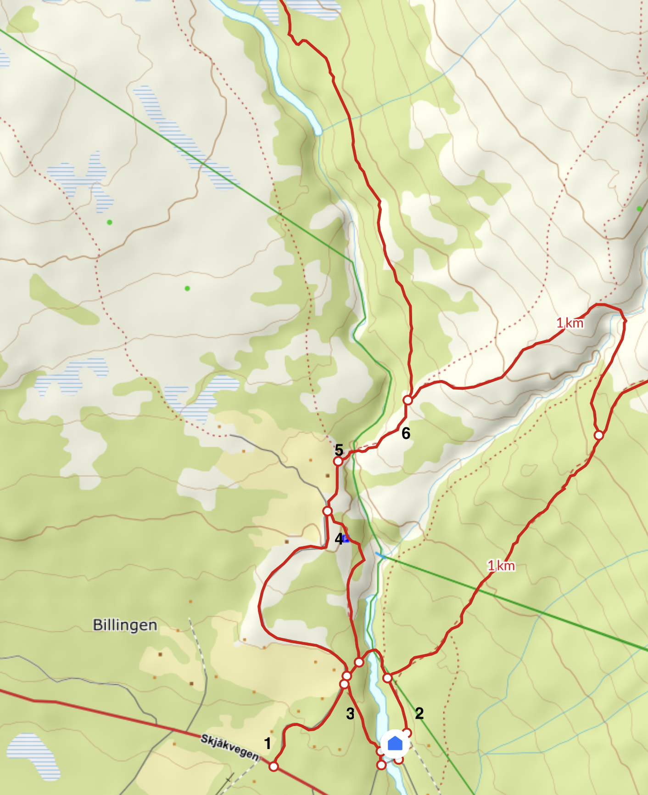
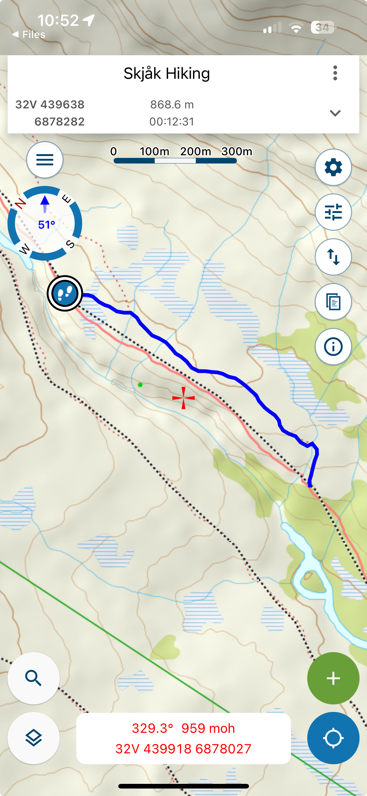

# Billingen - Torsbu (Tverråhytta)

Det ble gått befaringen av den nye ruta på østsiden av Torda fra Billingen til Tverråhytta, 18 juni 2025.

Deltakere: 
- Kristine Sørlie, nasjonalparkforvalter Reinheimen
- Tor Erik Myhren, grunneierrepresentant Skjåk almenning
- Andrea Vestvik, DNT Oslo ruteinspektør
- Ole Trøan, DNT Oslo områdekontakt Breheimen

Det var ønskelig å gå over ruta og vurdere hvordan ruta ble lagt på DNT dugnad i august 2024.
Den omlagte ruta er totalt ca 9.5km til Tverråhytta og følger eksisterende sti ca 7km.

Ruta følger en eksisterende sti frem til ei elveslette / myrområde.
Det opprinnelige forslaget var å legge stien i høyden rundt sletta og deretter følge høydekurven videre frem til brua.
På dugnaden ble det istedet valgt å legge stien direkte over elveslettene. Med merking med stolper (2x4 til overs fra brubygging).
Og så gå opp til brua over ett høydedrag og inn på eksisterende tråkk langs en liten rygg på sva.

Det var noe bekymring om elvesletta ville være for våt og om det ville bli slitasjeskader om stien skulle gå der.
I tillegg ville man se på generelt rutevalg i forhold til slitasjeskader og erosjon.
Typisk kryssing av bekker, og våtområder, eller bratte traverseringer.

## Bemerkninger

### Billingen

På UT starter ruta på parkeringen ved sætra (4).
Det er i utgangspunktet 4 mulige startpunkter.
- Nede ved riksveien (1). Der har DNT en skiltstolpe allerede.
- På parkeringen ved sætra (4)
- Ved Billingen sæterpensjonat (2) og opp langs østsiden og så over utleggsbrua
- Ved Billingen sæterpensjonat (3) og opp langs vestsiden av elva og langs kulturstien opp til parkeringen

Det står en skiltstolpe ved øverste parkering. Og det er T-merket langs østsiden av elva fra sæterpensjonatet over utleggsbrua og opp til øverste parkering.

#### Oppgaver
1. Skilt ved Sæterpensjonatet kombinert med NP skiltet
2. Utvide UT ruten til å starte ved sæterpensjonatet
3. Manglende skrue på skilt ved skiltstolpe (5). Stokkebrua.
4. Manglende merking mellom stokkebrua og skiltstolpe (6). Sette opp 2 varder og merke på furu.

### Skitaren

Det opprinngelige sauetråkket gikk i henget mot elva. Her er det såpass bratt at det er fare for utglidning.

Istedet legger vi ruta som vist i kartutsnittet og følger sti som krysser bekken litt høyere og følger ryggen innover. Denne stien er på kartet, men går så ned ett tråkk som ikke vises på kartet. Følg ruta som vista på kartutstnitt.

#### Oppgaver

Flytt varder på nederste sti til øverste. Gjennbruk stein og bruk bærenettet til å dra steinene opp til øverste sti.

### Tverråhytta

Vi la stien direkte fra brua og opp til stiskille til Vetldalshytta. Erosjonsutsatt og folk flest vil nok gå via hytta uansett.

#### Oppgaver

1. Skiltstolpe ved brua (1). Flytt skiltene til å peke mot hytta. Eventuelt fjern skiltstolpen fullstendig?
2. Skiltstolpe ved Veltdalshyttekrysset (2). Flytt skiltet til å peke ned mot Tverråhytta
3. Flytt varden ved brua og bautaen oppe i bakken til stien mellom brua og Tverråhytta (3)
4. Flytt varden på toppen av bakken nærmere skiltstolpen (2). Men sørg for at den fortsatt er synlig fra Tverråhytta

### Generelt

#### Oppgaver

1. Det mangler T-maling på en god del varder. Frisk gjerne opp noe av malingen som allerede har flasset.
2. 
3. Legge om stien der den flommet over
4. Klopper på alle våte steder/bekker. Nøyaktig sted må noteres. Lengde på klopp beregnes
5. Male på manglende T’er
